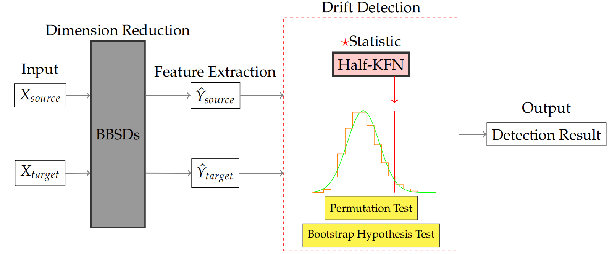

# `Half-KFN`

An Enhanced  Detection Method for Subtle Covariate Drift

Paper URL: https://doi.org/10.48550/arXiv.2410.08782

### Description

Detecting covariate drift is a common task of significant practical value in supervised learning. Once covariate drift occurs, the models may no longer be applicable, hence numerous studies have been devoted to the advancement of detection methods. However, current research methods are not particularly effective in handling subtle covariate drift when dealing with small proportions of drift samples. In this paper, inspired by the $k$-nearest neighbor (KNN) approach, a novel method called Half $k$-farthest neighbor (Half-KFN) is proposed in response to specific scenarios. Compared to traditional ones, Half-KFN exhibits higher power due to the inherent capability of the farthest neighbors which could better characterize the nature of drift. Furthermore, with larger sample sizes, the employment of the bootstrap for hypothesis testing is recommended. It is leveraged to calculate $p$-values dramatically faster than permutation tests, with speed undergoing an exponential growth as sample size increases. Numerical experiments on simulated and real data are conducted to evaluate our proposed method, and the results demonstrate that it consistently displays superior sensitivity and rapidity in covariate drift detection across various cases. 

### Architecture



Covariate drift detection architecture with Half-KFN: 
<ol type="A">
    <li>Data are respectively sampled from source and target distributions. </li>
    <li>The BBSDs method is applied for performing dimensionality reduction. </li>
    <li>Our proposed statistical measure, Half-KFN, is utilized to quantify the magnitude of drift differences. </li>
    <li>Permutation test and bootstrap hypothesis test is employed to obtain the corresponding <i>p</i>-value. </li>
</ol>

### Installation
After creating Python 3.6+ and installing requirements.txt, you should install [torch-two-sample](https://github.com/josipd/torch-two-sample) first with:

```
cd torch-two-sample
python setup.py install
cd ..
```
### Running experiments

Run single experiments using:

```
python halfkfn.py DATASET_NAME SHIFT_TYPE two_sample
```

Example: `python halfkfn.py mnist adversarial_shift two_sample`

## Folder Structure:
- ```datasets```: contains datasets used for experimentation.
- ```paper_results```: contains experimentation results.
- ```torch-two-sample```: contains the traditional and our proposed detection methods used in the experiment.
- ```models```: contains pretrained neural network models.
- ```utils```: the source codes and utility functions written fully in Python.  
   - ```saved_models```: contains pretrained neural network models.

### Dependencies

We require the following dependencies:
- `keras`: https://github.com/keras-team/keras 
- `tensorflow`: https://github.com/tensorflow/tensorflow
- `pytorch`: https://github.com/pytorch/pytorch
- `sklearn`: https://github.com/scikit-learn/scikit-learn
- `matplotlib`: https://github.com/matplotlib/matplotlib
- `torch-two-sample`: https://github.com/josipd/torch-two-sample
- `keras-resnet`: https://github.com/broadinstitute/keras-resnet
- `foolbox`: https://github.com/bethgelab/foolbox

### Reference
Core related work include  
  *  [Detecting and Correcting for Label Shift with Black Box Predictors](https://arxiv.org/pdf/1802.03916.pdf).
  *  [Failing Loudly: An Empirical Study of Methods for Detecting Dataset Shift](https://arxiv.org/pdf/1810.11953.pdf).
  *  [Foolbox: A Python toolbox to benchmark the robustness of machine learning models](https://arxiv.org/abs/1707.04131).
  *  [Foolbox Native: Fast adversarial attacks to benchmark the robustness of machine learning models in PyTorch, TensorFlow, and JAX](https://doi.org/10.21105/joss.02607).
